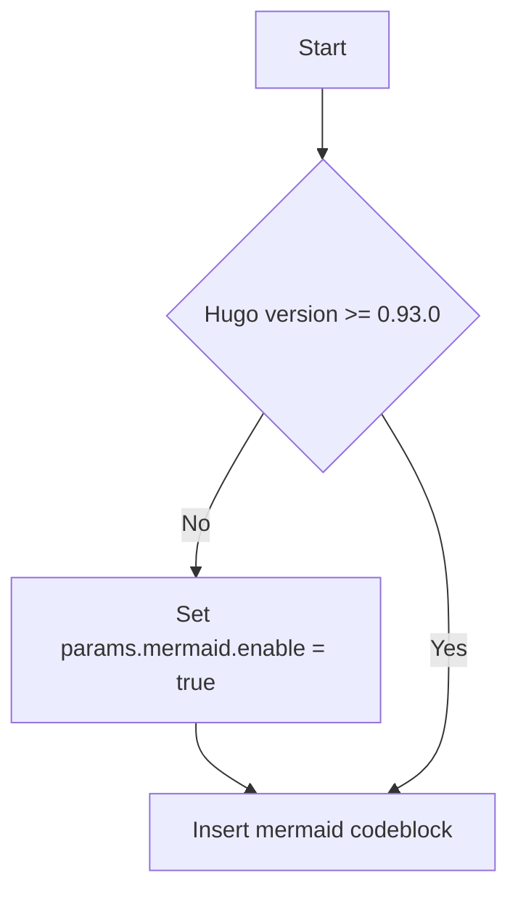

# H1

## H2 标题

### H3

#### H4

##### H5

###### H6

####### H7

######## H8

## emoji

👨🏻‍💻 🕵️‍♂️ 🦌 🐳 🙄 🤹 💲

## 表格

| 形状      | 边数            |
| -------- | --------------- |
| Triangle | 3               |
| Square   | 4               |

| 形状      | 边数            |
| -------- | --------------- |
| Triangle | 3               |
| Square   | 4               |
{.td-initial}

## 列表

* This is an unordered list following a header.
* This is an unordered list following a header.
* This is an unordered list following a header.

1. This is an ordered list following a header.
2. This is an ordered list following a header.
3. This is an ordered list following a header.

- [x] It may seem strange to see a "Hello" post from a project that's several years old
- [ ] but as Docsy matures as a community-driven project
- [x] we thought it was time to (re)introduce ourselves and talk about what's new with your favorite (we hope) Hugo documentation theme!

## 链接

Docsy now has a Project Steering Committee! The PSC members are [@chalin][], [@LisaFC][], [@geriom][], and [@emckean][]. If you're interested in serving on the PSC, open an [issue](https://github.com/google/docsy/issues) and nominate yourself!

[@chalin]: https://github.com/chalin
[@LisaFC]: https://github.com/LisaFC
[@geriom]: https://github.com/geriom
[@emckean]: https://github.com/emckean

## 公式

### 数学公式

KaTeX LaTeX

内联公式：

When \\(a \ne 0\\), there are two solutions to \\(ax^2 + bx + c= 0\\) and they are \\(x = {-b \pm \sqrt{b^2-4ac} \over 2a}\\).

显示模式的公式：

The probability of getting \\(k\\) heads when flipping \\(n\\) coins is:
```math
\tag*{(1)} P(E) = {n \choose k} p^k (1-p)^{n-k}
```

$$
\tag*{(1)} P(E) = {n \choose k} p^k (1-p)^{n-k}
$$

### 化学方程式和物理单位的显示

mhchem

*Precipitation of barium sulfate:* \\(\ce{SO4^2- + Ba^2+ -> BaSO4 v}\\)

```chem
\tag*{(2)} \ce{Zn^2+  <=>[+ 2OH-][+ 2H+]  $\underset{\text{amphoteric hydroxide}}{\ce{Zn(OH)2 v}}$  <=>[+ 2OH-][+ 2H+]  $\underset{\text{tetrahydroxozincate}}{\ce{[Zn(OH)4]^2-}}$}
```

$$
\tag*{(2)} \ce{Zn^2+  <=>[+ 2OH-][+ 2H+]  $\underset{\text{amphoteric hydroxide}}{\ce{Zn(OH)2 v}}$  <=>[+ 2OH-][+ 2H+]  $\underset{\text{tetrahydroxozincate}}{\ce{[Zn(OH)4]^2-}}$}
$$

* Scientific number notation: \\(\pu{1.2e3 kJ}\\) or \\(\pu{1.2E3 kJ}\\) \\
* Divisions: \\(\pu{123 kJ/mol}\\) or \\(\pu{123 kJ//mol}\\)

## 绘制图表

​ Mermaid 



PlantUML

```plantuml
participant participant as Foo
actor       actor       as Foo1
boundary    boundary    as Foo2
control     control     as Foo3
entity      entity      as Foo4
database    database    as Foo5
collections collections as Foo6
queue       queue       as Foo7
Foo -> Foo1 : To actor
Foo -> Foo2 : To boundary
Foo -> Foo3 : To control
Foo -> Foo4 : To entity
Foo -> Foo5 : To database
Foo -> Foo6 : To collections
Foo -> Foo7: To queue
```

MarkMap

```markmap
# markmap

## Links

- <https://markmap.js.org/>
- [GitHub](https://github.com/gera2ld/markmap)

## Related

- [coc-markmap](https://github.com/gera2ld/coc-markmap)
- [gatsby-remark-markmap](https://github.com/gera2ld/gatsby-remark-markmap)

## Features

- links
- **inline** ~~text~~ *styles*
- multiline
  text
- `inline code`
-
    ```js
    console.log('code block');
    ```
- Katex - $x = {-b \pm \sqrt{b^2-4ac} \over 2a}$
```
