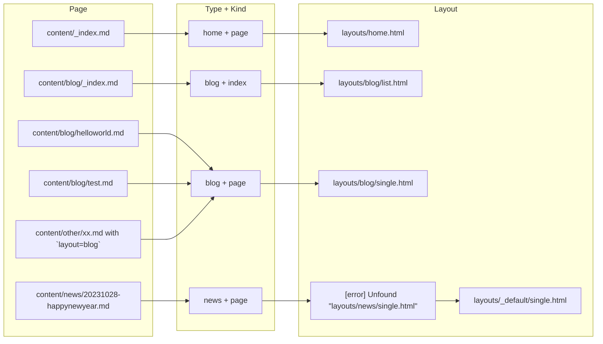

[模板查找顺序（Template lookup order）]: https://gohugo.io/templates/lookup-order/

## 概念 - 使用布局的好处

在一个站点中，同一类页面（`Page`）他们的样式一般是一样的。通过将共同的样式代码抽离为一个布局文件（`Layout`）可以大大避免重复编码，简化编写页面的工作量。同时，也可以统一管理同一种页面的页面布局，使统一站点风格变得可能。

进一步考虑，将页面编写和布局编写的工作分开，可以将责任分割，进一步提高站点的可管理性：

+ 文章编写者专心写文章
+ 样式编写者专心定制站点样式，进一步封装成主题（`Theme`），可以跨站点使用。

## 概念 - 页面（Page）和页面布局（Layout）的对应关系

一般情况，我们使用 Hugo 时，会直接使用现成的主题（Themes）。因为主题里面有现成的布局，这样我们就不需要关心如何定制布局，而只需要关注如何使用布局，然后专心内容的编写即可。

> 当然，知道如何定制布局也非常有用，这将在下一章"[布局定制]()"讨论

了解如何使用布局，首先需要知道页面（Page）和页面布局（Layout）的对应关系。

下图展示了对应关系的几种可能：

1. 多数情况下，对应关系由 "[模板查找顺序（Template lookup order）][]" 决定。
1. 少数情况下，对应关系在前置元数据（FrontMatter）中指定。



> + Kind —— `home`/`page`/`section`
> + Tyoe —— `page`/section-name(e.g. `docs`/`blog`/`community`)

### 按模板查找顺序查找页面布局

根据 "[模板查找顺序（Template lookup order）][]" 找到页面和页面布局的对应关系： （细节使用参考官方文档，下面仅为个人"最佳实践"）

1. Type —— 页面类型，找到模板所在目录。如：`content/blog/xx.md`的Type默认为`blog`，于是找有没有定义`layouts/blog/`，如果没有则找`layouts/_default/`
1. Kind —— 页面种类，找到模板
    + home —— 固定位置 `content/_index.md` 文件使用 `layouts/home.html` 页面布局
    + section —— 顶部文件夹文件名 `_index.md` 文件 (如`content/blog/_index.md`) 使用 `layouts/blog/list.html` 页面布局
    + page —— 非顶部文件夹文件名 `_index.md` 文件 (如`content/docsy/content-management/_index.md`) 或者非 `_index.md` 文件 （如`content/docsy/command.md`） 使用 `layouts/docs/single.html` 页面布局

> 一般依据上述规则就可以找到页面布局存放的位置。如果位置上没有页面布局文件，则找最近的 `baseof.html` 文件。

### 在前置元数据（FrontMatter）中指定页面布局

在 `type` 或者 `layout` 中指定 `section`，必要的时候用 `kind` 指定页面类型。

e.g. 下面的前置元数据将指定使用 `layouts/blog/single.html` 模板

```yaml
---
kind: page
type: blog
---
```

## 相关视频教程

（从左往右看）

{}
{}
{}
{}
{}
{}
{}
